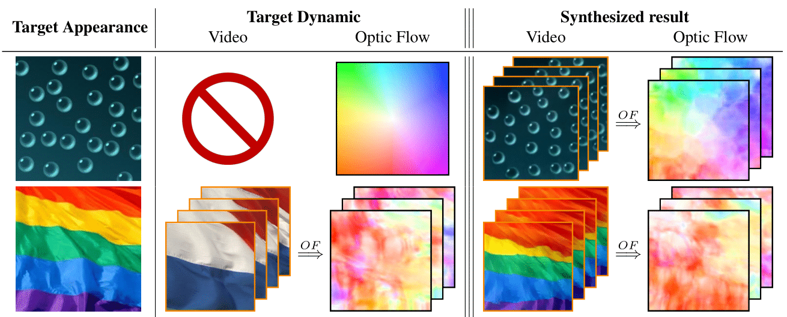

# DyNCA: Real-Time Dynamic Texture Synthesis Using Neural Cellular Automata (CVPR 2023)

[](https://arxiv.org/abs/2211.11417)

[[Project Website](https://dynca.github.io/)]

This is the official implementation of DyNCA, framework for real-time and controllable dynamic texture synthesis. Our
model can learn to synthesize dynamic texture videos such that:

* The frames of the video resemble a given target appearance
* The succession of the frames induces the motion of the target dynamic which can either be a video or a motion vector
  field



[comment]: <> (Starting from a seed state, DyNCA iteratively updates it, generating an image sequence. We extract images from this)

[comment]: <> (sequence and compare them with an appearance target as well as a motion target to obtain the DyNCA training objectives.)

[comment]: <> (After training, DyNCA can adapt to seeds of different height and width, and synthesize videos with arbitrary length.)

[comment]: <> (Sequentially applying DyNCA updates on the seed synthesizes dynamic texture videos in real-time.)

## Run in Google Colab

DyNCA can learn the target motion either from a video or a motion vector field. In the table below you can find the
corresponding notebooks for different modes of training DyNCA.

| **Target Motion** | **Colab Notebook** | **Jupyter Notebook** |
|:-----------------:|:------------------:|:--------------------:|
| VectorField | [](https://colab.research.google.com/github/IVRL/DyNCA/blob/main/notebooks/vector_field_motion_colab.ipynb) | [vector_field_motion.ipynb](notebooks/vector_field_motion.ipynb) |
|  Video | [](https://colab.research.google.com/github/IVRL/DyNCA/blob/main/notebooks/video_motion_colab.ipynb)                   |           [video_motion.ipynb](notebooks/video_motion.ipynb)            |


## Run Locally

If you would like to train DyNCA in a local environment, please follow the steps outlined below.

### Installing Requirements

1. System Requirements
- Python 3.8
- CUDA 11
- GPU with minimum 12 GB RAM
2. Dependencies
    1. Install PyTorch using the command from the official [tutorial](https://pytorch.org/get-started/previous-versions/#linux-and-windows-12). We have tested on PyTorch 1.10.0cu113.  
    2. Install other dependencies by running the following command.
    ```
    pip install -r requirements.txt
    ```

### Run the training scripts
1. Vector Field Motion
```
python fit_vector_field_motion.py --target_appearance_path /path/to/appearance-image --motion_vector_foeld_name "circular"
```
See ```utils/loss/vector_field_loss.py``` and our [supplementary materials](https://dynca.github.io/supplementary/) for more names of vector fields. 

2. Video Motion
```
python fit_video_motion.py --target_dynamics_path /path/to/target-dynamic-video --target_appearance_path /path/to/appearance-image-or-video
```
We provide some sample videos under ```data/VideoMotion/Motion```

### Visualizing with Streamlit
After the training process is completed, the results can be visualized using the streamlit app, which is available in the result folder.
```
cd apps
streamlit run visualize_trained_models.py
```

## Citation

If you make use of our work, please cite our paper:

```
@InProceedings{pajouheshgar2022dynca,
  title     = {DyNCA: Real-Time Dynamic Texture Synthesis Using Neural Cellular Automata},
  author    = {Pajouheshgar, Ehsan and Xu, Yitao and Zhang, Tong and S{\"u}sstrunk, Sabine},
  booktitle = {Proceedings of the IEEE Conference on Computer Vision and Pattern Recognition (CVPR)},
  year      = {2023},
}
```
